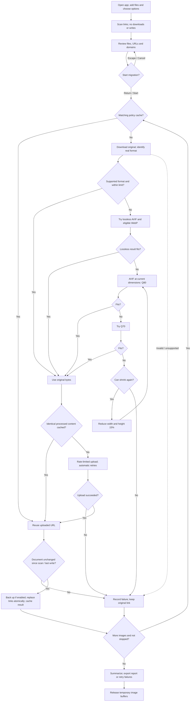

# IMG Link Migrator

[中文说明](README_CN.md)

A native macOS app that optimizes externally linked images, uploads them to ImgBB or a PicGo-compatible service, and replaces the links in Markdown and text documents. The app bundles its Python runtime and image codecs; users do not need Python, Homebrew, or plugins.

## Install

Requires macOS 13 or later. Choose the **single-architecture** download for your Mac:

| Download | Mac |
| --- | --- |
| `IMG-Link-Migrator-1.0.0-arm64.zip` | Apple Silicon: M1 and later |
| `IMG-Link-Migrator-1.0.0-x86_64.zip` | Intel |

Unzip and drag `IMG Link Migrator.app` to Applications. No Universal app is distributed. Local builds use an ad-hoc signature unless a Developer ID identity is supplied. They are not notarized; macOS may require an explicit approval in Privacy & Security for a downloaded build. Developer ID signing and notarization instructions are below.

## Use

1. Add one or more `.txt`, `.md`, or `.markdown` files, or folders. Folders are searched recursively. Drag and drop also works.
2. Choose **ImgBB**, **PicGo.net**, or **Custom PicGo API**, and enter the corresponding API key.
3. Choose an image mode and any advanced options. **Size Limit** and document backups are enabled by default.
4. Click **Scan**. Scanning only reads documents; it does not download images, upload, or change files. Review the files, image URLs, counts, and source domains, then uncheck domains to skip.
5. Click **Start Migration**. In confirmation dialogs, **Return accepts** and **Escape cancels**. No `y/n` input or automatic timeout approval is used.
6. Review each image's status, output format, size, dimensions, and encoding quality. Retry failed items or export the JSON report.

Images are recognized in inline Markdown, referenced Markdown images whose definitions are used, and HTML `` tags. Bare image URLs are recognized only in `.txt` files. Frontmatter, fenced code blocks, and inline code are skipped. The app preserves existing link text and document structure.

## Options

| Option | Default / behavior |
| --- | --- |
| Upload to | ImgBB; PicGo.net and custom HTTPS PicGo-compatible API supported |
| API key | Empty; kept in memory for the app session |
| Custom service URL | `https://www.picgo.net`; used only for Custom PicGo API |
| Custom upload limit | 25 MB; adjustable from 1 to 100 MB |
| Image mode | Size Limit |
| Back up documents | Enabled |
| Include domains | Empty: all otherwise eligible domains; comma-separated |
| Exclude domains | `xhscdn`; comma-separated; destination service domains also excluded |
| Source domain selection | All scanned domains enabled; uncheck a domain to skip |
| Show URLs | Enabled; turn off to show host names instead |
| Delete after (seconds) | 0: never; otherwise 60–15,552,000 seconds, subject to service support |
| Automatic retries | 3; adjustable from 0 to 10 |
| State directory | `~/Library/Application Support/IMG Link Migrator` |
| Automatic JSON report | Empty; optionally choose an output file |
| Export Report | Save the latest run report after a task finishes |
| Retry Failed | Retry failed images selected by the current domain filters |
| Stop | Stop starting new images; finish the current operation at a safe point |

Blank API keys use `IMGBB_API_KEY`, `PICGO_API_KEY`, or the legacy `CHEVERETO_API_KEY` from the app's environment. Apps launched from Finder do not automatically inherit Terminal shell variables. Keys are never saved in settings, cache, backups, logs, or reports.

## Image rules

**Size Limit (default):** every uploaded image is strictly smaller than **1,000,000 bytes**. **Original Upload:** supported images within the selected service's upload limit are passed through unchanged; oversized or unsupported images enter the same conversion process, using the service limit as their target.

A supported image already within its target limit is not re-encoded. Otherwise:

1. Try lossless AVIF. For ordinary 8-bit images, also try lossless WebP. Choose the smaller acceptable lossless result.
2. If neither fits, encode AVIF at quality **80**, then **70**, at the original dimensions.
3. If both are too large, reduce both dimensions by **15%**, then try **80 → 70** again.
4. Repeat as needed. Every candidate is generated from the original decoded image at the required scale, avoiding repeated lossy encoding of a previous candidate.

Compression stops after at most 32 dimension levels or when the smaller dimension reaches 16 pixels. A failed, invalid, unsupported, or still oversized image keeps its original document link and is not uploaded. Download size is separately capped at 100,000,000 bytes; images requiring processing are capped at 100 megapixels. The size limit applies to the encoded image file, before the upload form is assembled.

No separate rotation, flip, orientation correction, or preliminary resizing is applied. The HEIF decoder applies format-defined display transforms; mappable orientation metadata is retained by the codecs. Source chroma is used when identifiable: 4:2:0 stays 4:2:0 for lossy output; 4:2:2 is represented as 4:4:4 because the bundled encoder exposes 4:2:0/4:4:4. Lossless AVIF uses RGB identity and 4:4:4 as required. Unknown chroma uses the encoder's default. Supported ICC/CICP color information and alpha are carried through; 10/12-bit inputs stay 10/12-bit in AVIF. Unsupported bit depths/color spaces fail instead of silently becoming ordinary 8-bit images. Lossless encoding describes preservation of the decoded raster, not recovery of information previously lost in JPEG/HEIC or retention of every container-specific auxiliary item. No separate pixel-by-pixel equality check is performed.

Animated or multi-image files can pass through when supported and small enough. They are not flattened to a still image; files needing frame-aware compression are reported as unsupported.

## Services and formats

| Service | Original image formats used by this app | Upload limit |
| --- | --- | --- |
| ImgBB | JPEG, PNG, BMP, GIF, WebP, AVIF, HEIC/HEIF, TIFF; decodable SVG, JPEG 2000, JXL, ICO and PSD | 32,000,000 bytes |
| PicGo.net | JPEG, PNG, BMP, GIF, WebP, AVIF | 25,000,000 bytes |
| Custom PicGo API | Same image policy as PicGo.net; service must accept AVIF/WebP | Configurable |

The actual decoder must support the source file. This is an image migration app; PDF, PostScript, and video uploads are not handled. ImgBB lists a broader uploader accept list than the app's supported decoders. Service acceptance can change and uploaded files may be transformed by the service. Sources: [ImgBB uploader](https://imgbb.com/), [ImgBB API](https://api.imgbb.com/), [PicGo.net uploader](https://www.picgo.net/).

## Workflow



## Cache, retries, files, and cleanup

- URL and processed-content caches are separated by platform/API endpoint, image mode, upload cap, and processing rule version. Original-mode links cannot bypass the 1 MB policy. Expiring entries are reused only while still valid.
- Upload attempts, including retries, share a limiter of at most 50 per minute. Platform throttling triggers a pause before retrying. Network and server failures use the existing bounded backoff.
- Links are replaced only after successful upload or a valid cached result. Documents changed outside the app since the scan or last successful write are not overwritten. Uploaded URLs remain available in the cache/report.
- Enabled backups preserve each document before the task's first change, under the state directory. Writes use a temporary file and atomic replacement.
- Stop/quit waits for a safe point. Completed uploads and writes are kept. A scan is required again after changing input files, provider, endpoint, or domain filters.
- Images are processed in memory; temporary buffers are released as the task advances. No image download directory is persisted. URL/content mappings, backups, and exported reports remain until you remove them yourself.

## Build from source

Requires macOS, Xcode Command Line Tools (`xcode-select --install`), a development Python 3.11 or later, and network access. On Apple Silicon, Intel builds also require Rosetta 2. Intel Macs build the Intel package; use an Apple Silicon Mac for the arm64 package.

```sh
python3 scripts/build_app.py --arch arm64
python3 scripts/build_app.py --arch x86_64
# Build both on Apple Silicon:
python3 scripts/build_app.py --arch all
```

The builder downloads pinned, SHA-256-checked standalone Python runtimes into the ignored `build/` directory, creates architecture-specific environments, bundles pyvips/libvips codecs with PyInstaller, compiles SwiftUI, and assembles architecture-specific ZIPs in `dist/`. Nothing is installed in the system Python. The Python modules are private app components; there is no supported CLI, Tk GUI, or `.command` launcher.

For public distribution, supply a Developer ID identity and optionally a configured notarytool Keychain profile:

```sh
python3 scripts/build_app.py --arch arm64 --sign 'Developer ID Application: Your Name (TEAMID)' --notary-profile your-profile
```

The builder signs embedded executables, notarizes the ZIP, staples the app, and rebuilds the ZIP. Credentials stay in your Keychain. Omit these flags for a local ad-hoc-signed build.

Only the existing core tests and a small policy smoke check are needed:

```sh
build/venv-arm64/bin/python -m unittest discover -s tests
```

The bundles contain component license notices in `Contents/Resources/Licenses`. See [THIRD_PARTY.md](THIRD_PARTY.md) for versions, source links, and replacement/rebuild information. Project license: [MIT](LICENSE).
