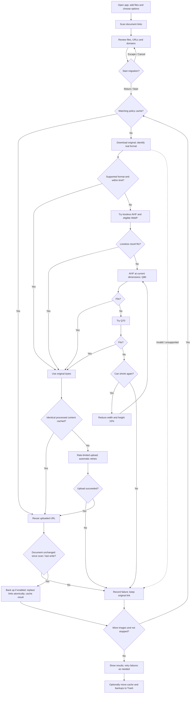

# IMG Link Migrator

[中文说明](README_CN.md)

A native macOS app that optimizes externally linked images, uploads them to ImgBB or PicGo.net, and replaces the links in Markdown and text documents. The app bundles its Python runtime and image codecs.

## Install

Requires macOS 13 or later. Choose the **single-architecture** download for your Mac:

| Download | Mac |
| --- | --- |
| `IMG-Link-Migrator-1.0.0-arm64.zip` | Apple Silicon: M1 and later |
| `IMG-Link-Migrator-1.0.0-x86_64.zip` | Intel |

Unzip and drag `IMG Link Migrator.app` to Applications.

## Use

1. Add one or more `.txt`, `.md`, or `.markdown` files, or folders. Folders are searched recursively. Drag and drop also works.
2. Choose **ImgBB** or **PicGo.net**, and enter your API key in the app's **API key** field.
3. Choose an image mode and any advanced options. **Size Limit** and document backups are enabled by default.
4. Click **Scan**. Review the files, image URLs, counts, and source domains, then uncheck domains to skip.
5. Click **Start Migration**. In confirmation dialogs, **Return accepts** and **Escape cancels**.
6. Review each image's status, output format, size, dimensions, and encoding quality. Retry failed items as needed.

Images are recognized in inline Markdown, referenced Markdown images whose definitions are used, and HTML `` tags. Bare image URLs are recognized only in `.txt` files. Frontmatter, fenced code blocks, and inline code are skipped. The app preserves existing link text and document structure.

## Options

| Option | Default / behavior |
| --- | --- |
| Upload to | ImgBB or PicGo.net; default ImgBB |
| API key | Entered in the app's secure field; saved in macOS Keychain |
| Image mode | Size Limit |
| Back up documents | Enabled |
| Include domains | `xhscdn`: match host names containing this keyword; clear to include all eligible domains; comma-separated |
| Exclude domains | Empty; comma-separated; destination service domains also excluded |
| Source domain selection | All scanned domains enabled; uncheck a domain to skip |
| Show URLs | Enabled; turn off to show host names instead |
| Automatic retries | 3; adjustable from 0 to 10 |
| State directory | `~/Library/Application Support/IMG Link Migrator` |
| Clear Cache and Backups | Move the upload cache and document backups in the state directory to Trash; available while idle |
| Retry Failed | Retry failed images selected by the current domain filters |
| Stop | Stop starting new images; finish the current operation at a safe point |

Enter the key for the selected platform before starting migration. ImgBB and PicGo.net keys are stored separately in macOS Keychain and restored when the app opens or the platform changes. The last selected platform is remembered. Clearing the key field removes that platform's saved key. The backend redacts the current key from activity messages.

## Image rules

**Size Limit (default):** every uploaded image is strictly smaller than **1,000,000 bytes**. **Original Upload:** supported images within the selected service's upload limit are passed through unchanged; oversized or unsupported images enter the same conversion process, using the service limit as their target.

A supported image already within its target limit uses the original file. Otherwise:

1. Try lossless AVIF. For ordinary 8-bit images, also try lossless WebP. Choose the smaller acceptable lossless result.
2. If neither fits, encode AVIF at quality **80**, then **70**, at the original dimensions.
3. If both are too large, reduce both dimensions by **15%**, then try **80 → 70** again.
4. Repeat as needed. Every candidate is generated from the original decoded image at the required scale, avoiding repeated lossy encoding of a previous candidate.

Compression stops after at most 32 dimension levels or when the smaller dimension reaches 16 pixels. Processing failures are recorded and keep the original document link. Download size is separately capped at 100,000,000 bytes; images requiring processing are capped at 100 megapixels. The size limit applies to the encoded image file, before the upload form is assembled.

Dimensions stay at their original values until the shrink step. AVIF output supports 8-, 10-, and 12-bit images. Supported ICC color information and alpha are carried through. For AVIF/HEIC, NCLX primaries and transfer tags are retained, while the output matrix/range match the new encoding. Lossless AVIF uses RGB identity and 4:4:4. Lossy output preserves 4:2:0 sampling; 4:1:1, 4:2:2, 4:4:0, and 4:4:4 sources use 4:4:4. Other sampling uses the encoder's default.

## Services and formats

| Service | Original image formats used by this app | Upload limit |
| --- | --- | --- |
| ImgBB | JPEG, PNG, BMP, GIF, WebP, AVIF, HEIC/HEIF, TIFF; decodable SVG, JPEG 2000, ICO and PSD | 32,000,000 bytes |
| PicGo.net | JPEG, PNG, BMP, GIF, WebP, AVIF | 25,000,000 bytes |

Formats are identified from image data. Uploads use indefinite retention, with automatic deletion disabled. Service references: [ImgBB uploader](https://imgbb.com/), [ImgBB API](https://api.imgbb.com/), [PicGo.net uploader](https://www.picgo.net/).

## Workflow



## Cache, retries, and document writes

- URL and processed-content caches are separated by platform, image mode, upload cap, and processing rule version. Only permanent upload entries are reused.
- Upload attempts, including retries, share a limiter of at most 50 per minute. Platform throttling triggers a pause before retrying. Network and server failures use the existing bounded backoff.
- Links are replaced after successful upload or a valid cached result, when the document matches its scan or last successful write. Uploaded URLs remain available in the cache and image details.
- Enabled backups preserve each document before the task's first change, so the original links and text can be restored. Writes use a temporary file and atomic replacement.
- Stop/quit waits for a safe point. Completed uploads and writes are kept. A scan is required again after changing input files, platform, or domain filters.
- Images are processed in memory. URL/content mappings and document backups are stored in the state directory. **Clear Cache and Backups** moves `state.json` and `backups/` to Trash after confirmation. Restoring these items from Trash restores the local records; clearing them makes later tasks upload matching images again.

## Build from source

Requires macOS, Xcode Command Line Tools (`xcode-select --install`), a development Python 3.11 or later, and network access. On Apple Silicon, Intel builds also require Rosetta 2. Intel Macs build the Intel package; use an Apple Silicon Mac for the arm64 package.

```sh
python3 scripts/build_app.py --arch arm64
python3 scripts/build_app.py --arch x86_64
# Build both on Apple Silicon:
python3 scripts/build_app.py --arch all
```

The builder downloads pinned, SHA-256-checked standalone Python runtimes into `build/`, creates architecture-specific environments, bundles pyvips/libvips, Pillow fallback loaders, and the pi-heif HEVC decoder with PyInstaller, compiles SwiftUI, and assembles architecture-specific ZIPs in `dist/`.

The builder accepts a Developer ID identity through `--sign` and a configured notarytool Keychain profile through `--notary-profile`:

```sh
python3 scripts/build_app.py --arch arm64 --sign 'Developer ID Application: Your Name (TEAMID)' --notary-profile your-profile
```

With `--sign`, the builder signs the app and embedded executables. With `--notary-profile`, it submits the ZIP for notarization, staples the app, and rebuilds the ZIP. The default build uses an ad-hoc signature.

Run the core and image-policy checks:

```sh
build/venv-arm64/bin/python -m unittest discover -s tests
```

The bundles contain component license notices in `Contents/Resources/Licenses`. See [THIRD_PARTY.md](THIRD_PARTY.md) for versions, source links, and replacement/rebuild information. Project license: [GNU Affero General Public License v3](LICENSE).
