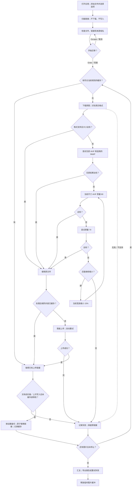

# IMG Link Migrator

[English](README.md)

原生 macOS 图片链接迁移应用：处理文档中的外链图片，上传至 ImgBB 或兼容 PicGo 的服务，再替换文档链接。应用内置 Python 和图片编解码器，使用者无需安装 Python、Homebrew 或插件。界面、提示、日志、代码注释均为英语。

## 安装

需要 macOS 13 或更新版本。按 Mac 的处理器选择独立安装包：

| 安装包 | 适用设备 |
| --- | --- |
| `IMG-Link-Migrator-1.0.0-arm64.zip` | Apple Silicon，M1 及后续芯片 |
| `IMG-Link-Migrator-1.0.0-x86_64.zip` | Intel Mac |

解压后，将 `IMG Link Migrator.app` 拖进「应用程序」。不发布 Universal 包；每个包仅含对应架构。没有提供 Developer ID 时，本地构建使用临时签名，未经 Apple 公证。下载后 macOS 可能要求在「隐私与安全性」中明确允许打开；公开发行的签名、公证方法见下文。

## 使用

1. 添加单个或多个 `.txt`、`.md`、`.markdown` 文件，或递归扫描的文件夹，也可拖放。
2. 选择 **ImgBB**、**PicGo.net** 或 **Custom PicGo API**，填写对应 API key。
3. 选择图片模式和高级选项。默认 **Size Limit**，并开启文档备份。
4. 点击 **Scan**。扫描只读取文档，不下载、不上传、不修改文件。查看文档、图片链接、数量及来源域名，取消勾选不处理的域名。
5. 点击 **Start Migration**。确认窗口 **Enter 同意、Escape 取消**，无需输入 y/n，也不会超时自动同意。
6. 查看每张图片的状态、输出格式、大小、尺寸、质量，重试失败项目或导出 JSON 报告。

继续识别行内 Markdown 图片、被图片引用使用的引用式定义、HTML ``。只有 `.txt` 识别裸图片 URL。跳过 frontmatter、围栏代码块及行内代码，保留链接文字和文档结构。

## 全部选项

| 选项 | 默认值／行为 |
| --- | --- |
| Upload to | ImgBB；另支持 PicGo.net、自定义 HTTPS 兼容 API |
| API key | 空；仅保存在当前应用会话内存 |
| Custom service URL | `https://www.picgo.net`；只用于自定义平台 |
| Custom upload limit | 25 MB；可设置 1–100 MB |
| Image mode | Size Limit |
| Back up documents | 开启 |
| Include domains | 空，即全部符合条件的域名；逗号分隔 |
| Exclude domains | `xhscdn`；逗号分隔；自动排除目标图床域名 |
| Source domain selection | 默认勾选扫描出的所有域名，可取消勾选 |
| Show URLs | 开启；关闭时显示域名 |
| Delete after (seconds) | 0 永不删除；否则 60–15,552,000 秒，需平台支持 |
| Automatic retries | 3；可设置 0–10 |
| State directory | `~/Library/Application Support/IMG Link Migrator` |
| Automatic JSON report | 空；可设置自动导出的文件路径 |
| Export Report | 任务结束后导出本次报告 |
| Retry Failed | 重试当前域名选择中的失败图片 |
| Stop | 不再开始新图片，当前操作到安全位置后结束 |

API key 留空时，读取应用环境中的 `IMGBB_API_KEY`、`PICGO_API_KEY` 或旧版 `CHEVERETO_API_KEY`。Finder 启动的应用不会自动继承 Terminal 的 shell 环境变量。Key 不写入设置、缓存、备份、日志或报告。

## 图片处理规则

**Size Limit，默认模式：**每张上传图片严格小于 **1,000,000 字节**。**Original Upload，原图上传模式：**格式支持且未超平台上限时直接使用原文件；超过上限或格式不支持时进入相同处理流程，目标大小改为平台上限。

格式支持且大小达标时不重复编码。需要处理时：

1. 尝试无损 AVIF；普通 8 位图片另尝试无损 WebP，选择达标结果中较小的。
2. 无损不达标，当前尺寸尝试 AVIF **质量 80 → 70**。
3. 两次均超限，当前宽高各缩小 **15%**，新尺寸重新尝试 **80 → 70**。
4. 重复，直到达标或触及终止条件。每个候选结果都从同一份原始解码数据按所需累计比例生成，避免反复压缩上一轮有损结果。

最多尝试 32 个尺寸级别，或较短边达到 16 像素后停止。无效、不支持、失败或仍超限的图片保留原链接，不上传。原图下载上限单独设为 100,000,000 字节；需要处理时最多 1 亿像素。大小限制针对图片编码后的文件，不包含上传表单的开销。

不额外旋转、翻转、校正方向或预先调整尺寸。HEIF 解码器会应用格式规定的显示变换；编解码器保留可映射的方向信息。可识别的原图采样优先沿用：有损 4:2:0 保留 4:2:0；因内置编码器只提供 4:2:0／4:4:4，4:2:2 用 4:4:4 表示。无损 AVIF 按要求使用 RGB identity 和 4:4:4；未知采样使用编码器默认值。传递受支持的 ICC／CICP 色彩信息及透明通道，10／12 位 AVIF 保持原位深。不能保留的位深或色彩空间直接报错。这里的无损指解码后像素的无损编码，不能恢复 JPEG／HEIC 之前已丢失的信息，也不承诺保留所有容器辅助数据。不单独做逐像素一致性验证。

动画／多图片文件支持且大小达标时直接使用。不会自动变成静态图；需要逐帧压缩的文件报告为不支持。

## 图床格式和大小

| 平台 | 应用可直接上传的原图格式 | 文件上限 |
| --- | --- | --- |
| ImgBB | JPEG、PNG、BMP、GIF、WebP、AVIF、HEIC／HEIF、TIFF；可解码的 SVG、JPEG 2000、JXL、ICO、PSD | 32,000,000 字节 |
| PicGo.net | JPEG、PNG、BMP、GIF、WebP、AVIF | 25,000,000 字节 |
| 自定义 PicGo API | 沿用 PicGo.net 图片策略，服务需支持 AVIF／WebP | 可配置 |

原图也必须被内置解码器识别。本应用处理图片，不处理 PDF、PostScript 或视频。ImgBB 上传器公布的接受列表比应用实际可解码的格式更广。平台可能变更接受规则或在上传后转换图片。来源：[ImgBB 上传页](https://imgbb.com/)、[ImgBB API](https://api.imgbb.com/)、[PicGo.net 上传页](https://www.picgo.net/)。

## 完整流程图



## 缓存、重试、文件安全和清理

- URL 缓存及处理后内容去重按平台／API 地址、模式、大小上限和规则版本隔离，原图模式的链接不能绕过 1 MB 限制。临时图片缓存需仍在有效期内才能复用。
- 上传和重试共享每分钟最多 50 次的限速器。平台限流时暂停后重试，网络及服务器失败采用有次数上限的退避。
- 成功上传或有符合条件的缓存后才替换链接。扫描或上次成功写入后被外部修改的文档不会被覆盖；已上传结果保存在缓存／报告中。
- 开启备份时，每次任务首次修改文档前在状态目录保存备份，写入采用临时文件及原子替换。
- 停止或退出时等待安全位置，保留已完成结果。修改输入、平台、地址或域名筛选后需要重新扫描。
- 图片在内存中处理，随处理进度释放临时缓冲，不持久化图片下载目录。URL／内容映射、备份及导出报告保留，需用户自行删除。

## 源码构建

需要 macOS、Xcode Command Line Tools（`xcode-select --install`）、开发用 Python 3.11 或更新版本以及网络。Apple Silicon 构建 Intel 包需要 Rosetta 2。Intel Mac 可构建 Intel 包；arm64 包使用 Apple Silicon Mac 构建。

```sh
python3 scripts/build_app.py --arch arm64
python3 scripts/build_app.py --arch x86_64
# 在 Apple Silicon 上构建两个包：
python3 scripts/build_app.py --arch all
```

构建器在被 Git 忽略的 `build/` 下载锁定版本、经过 SHA-256 校验的独立 Python，建立对应架构环境，使用 PyInstaller 打包 pyvips／libvips，编译 SwiftUI，最终在 `dist/` 生成独立架构 ZIP。不安装到系统 Python。Python 模块仅为应用内部组件，不保留用户 CLI、Tk GUI、`.command` 入口。

公开发行可提供 Developer ID 签名身份，以及已配置的 notarytool Keychain profile：

```sh
python3 scripts/build_app.py --arch arm64 --sign 'Developer ID Application: Your Name (TEAMID)' --notary-profile your-profile
```

构建器签名内置可执行文件，对 ZIP 公证，给应用附加公证票据后重新生成 ZIP。凭据保存在 Keychain。省略参数即为本地临时签名包。

只保留已有核心检查及少量处理策略验证：

```sh
build/venv-arm64/bin/python -m unittest discover -s tests
```

组件许可随应用保存在 `Contents/Resources/Licenses`。版本、源码及替换重建方法见 [THIRD_PARTY.md](THIRD_PARTY.md)。项目许可：[MIT](LICENSE)。
