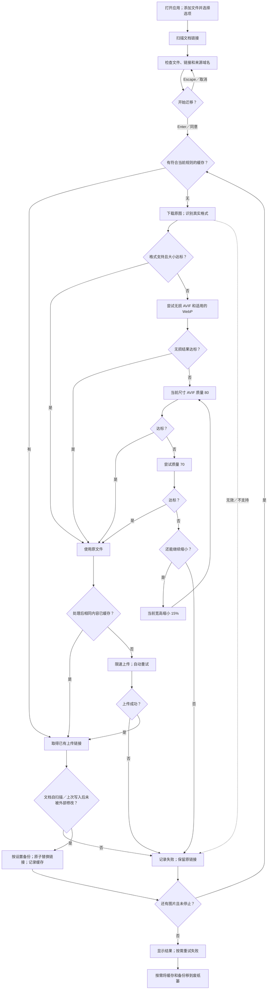

# IMG Link Migrator

[English](README.md)

原生 macOS 图片链接迁移应用：处理文档中的外链图片，上传至 ImgBB 或 PicGo.net，再替换文档链接。应用内置 Python 和图片编解码器，界面、提示、日志、代码注释均为英语。

## 安装

需要 macOS 13 或更新版本。按 Mac 的处理器选择独立安装包：

| 安装包 | 适用设备 |
| --- | --- |
| `IMG-Link-Migrator-1.0.0-arm64.zip` | Apple Silicon，M1 及后续芯片 |
| `IMG-Link-Migrator-1.0.0-x86_64.zip` | Intel Mac |

解压后，将 `IMG Link Migrator.app` 拖进「应用程序」。

## 使用

1. 添加单个或多个 `.txt`、`.md`、`.markdown` 文件，或递归扫描的文件夹，也可拖放。
2. 选择 **ImgBB** 或 **PicGo.net**，在应用界面的 **API key** 输入框填写自己的 key。
3. 选择图片模式和高级选项。默认 **Size Limit**，并开启文档备份。
4. 点击 **Scan**。查看文档、图片链接、数量及来源域名，取消勾选不处理的域名。
5. 点击 **Start Migration**。确认窗口 **Enter 同意、Escape 取消**。
6. 查看每张图片的状态、输出格式、大小、尺寸、质量，可重试失败项目。

继续识别行内 Markdown 图片、被图片引用使用的引用式定义、HTML ``。只有 `.txt` 识别裸图片 URL。跳过 frontmatter、围栏代码块及行内代码，保留链接文字和文档结构。

## 全部选项

| 选项 | 默认值／行为 |
| --- | --- |
| Upload to | ImgBB 或 PicGo.net；默认 ImgBB |
| API key | 在应用密码式输入框填写；保存在 macOS 钥匙串 |
| Image mode | Size Limit |
| Back up documents | 开启 |
| Include domains | `xhscdn`，匹配域名中含该关键词的链接；清空即包含全部符合条件的域名；逗号分隔 |
| Exclude domains | 空；逗号分隔；自动排除目标图床域名 |
| Source domain selection | 默认勾选扫描出的所有域名，可取消勾选 |
| Show URLs | 开启；关闭时显示域名 |
| Automatic retries | 3；可设置 0–10 |
| State directory | `~/Library/Application Support/IMG Link Migrator` |
| Clear Cache and Backups | 空闲时将状态目录中的上传缓存和文档备份移到废纸篓 |
| Retry Failed | 重试当前域名选择中的失败图片 |
| Stop | 不再开始新图片，当前操作到安全位置后结束 |

开始迁移前填写所选平台的 key。ImgBB 和 PicGo.net 的 key 分别保存在 macOS 钥匙串，打开应用或切换平台时自动读取。应用记住上次选择的平台；清空输入框会删除该平台保存的 key。后端在活动消息中隐藏当前 key。

## 图片处理规则

**Size Limit，默认模式：**每张上传图片严格小于 **1,000,000 字节**。**Original Upload，原图上传模式：**格式支持且未超平台上限时直接使用原文件；超过上限或格式不支持时进入相同处理流程，目标大小改为平台上限。

格式支持且大小达标时使用原文件。需要处理时：

1. 尝试无损 AVIF；普通 8 位图片另尝试无损 WebP，选择达标结果中较小的。
2. 无损不达标，当前尺寸尝试 AVIF **质量 80 → 70**。
3. 两次均超限，当前宽高各缩小 **15%**，新尺寸重新尝试 **80 → 70**。
4. 重复，直到达标或触及终止条件。每个候选结果都从同一份原始解码数据按所需累计比例生成，避免反复压缩上一轮有损结果。

最多尝试 32 个尺寸级别，或较短边达到 16 像素后停止。处理失败时记录错误并保留原链接。原图下载上限单独设为 100,000,000 字节；需要处理时最多 1 亿像素。大小限制针对图片编码后的文件。

尺寸在缩小步骤前保持原值。AVIF 输出支持 8、10、12 位图片。传递受支持的 ICC 色彩信息和透明通道；AVIF／HEIC 的 NCLX 原色、传递函数标签保留，输出矩阵和范围按新编码设置。无损 AVIF 使用 RGB identity 和 4:4:4。有损输出沿用 4:2:0 采样；原图为 4:1:1、4:2:2、4:4:0、4:4:4 时使用 4:4:4，其他采样使用编码器默认值。

## 图床格式和大小

| 平台 | 应用可直接上传的原图格式 | 文件上限 |
| --- | --- | --- |
| ImgBB | JPEG、PNG、BMP、GIF、WebP、AVIF、HEIC／HEIF、TIFF；可解码的 SVG、JPEG 2000、ICO、PSD | 32,000,000 字节 |
| PicGo.net | JPEG、PNG、BMP、GIF、WebP、AVIF | 25,000,000 字节 |

格式通过图片数据识别。上传统一采用无限期保存，关闭自动删除。平台资料：[ImgBB 上传页](https://imgbb.com/)、[ImgBB API](https://api.imgbb.com/)、[PicGo.net 上传页](https://www.picgo.net/)。

## 完整流程图



## 缓存、重试和文档写入

- URL 缓存及处理后内容去重按平台、模式、大小上限和规则版本隔离，复用永久上传记录。
- 上传和重试共享每分钟最多 50 次的限速器。平台限流时暂停后重试，网络及服务器失败采用有次数上限的退避。
- 上传成功或有符合条件的缓存，且文档与扫描或上次成功写入时一致时，替换链接。已上传链接保存在缓存和图片详情中。
- 开启备份时，每次任务首次修改文档前保存原文，用于恢复原始链接和文字。写入采用临时文件及原子替换。
- 停止或退出时等待安全位置，保留已完成结果。修改输入、平台或域名筛选后需要重新扫描。
- 图片在内存中处理。URL／内容映射和文档备份保存在状态目录。点击 **Clear Cache and Backups** 并确认后，将 `state.json` 和 `backups/` 移到废纸篓，可从废纸篓恢复；清理后，后续任务会重新上传匹配的图片。

## 源码构建

需要 macOS、Xcode Command Line Tools（`xcode-select --install`）、开发用 Python 3.11 或更新版本以及网络。Apple Silicon 构建 Intel 包需要 Rosetta 2。Intel Mac 可构建 Intel 包；arm64 包使用 Apple Silicon Mac 构建。

```sh
python3 scripts/build_app.py --arch arm64
python3 scripts/build_app.py --arch x86_64
# 在 Apple Silicon 上构建两个包：
python3 scripts/build_app.py --arch all
```

构建器在 `build/` 下载锁定版本、经过 SHA-256 校验的独立 Python，建立对应架构环境，使用 PyInstaller 打包 pyvips／libvips、Pillow 后备解码器及 pi-heif HEVC 解码组件，编译 SwiftUI，最终在 `dist/` 生成独立架构 ZIP。

构建器通过 `--sign` 接受 Developer ID 签名身份，通过 `--notary-profile` 接受已配置的 notarytool Keychain profile：

```sh
python3 scripts/build_app.py --arch arm64 --sign 'Developer ID Application: Your Name (TEAMID)' --notary-profile your-profile
```

使用 `--sign` 时，构建器签名应用及内置可执行文件；使用 `--notary-profile` 时，提交 ZIP 公证，给应用附加公证票据后重新生成 ZIP。默认构建使用临时签名。

运行核心和图片策略检查：

```sh
build/venv-arm64/bin/python -m unittest discover -s tests
```

组件许可随应用保存在 `Contents/Resources/Licenses`。版本、源码及替换重建方法见 [THIRD_PARTY.md](THIRD_PARTY.md)。项目许可：[GNU Affero General Public License v3](LICENSE)。
